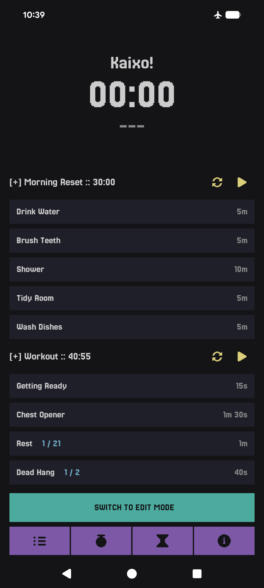
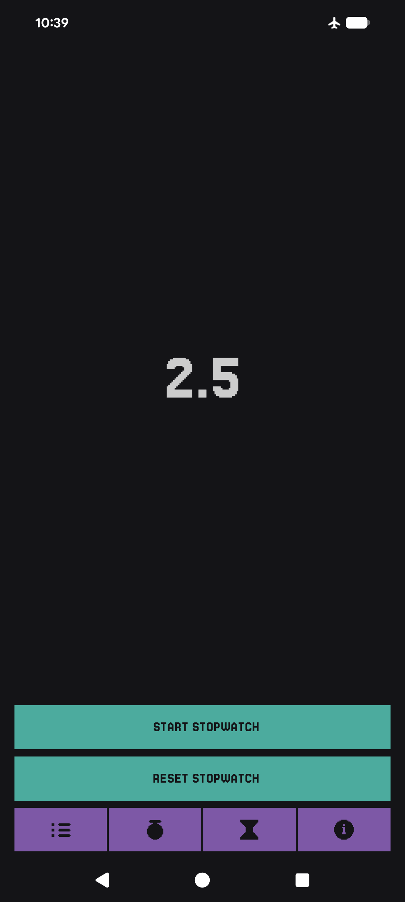
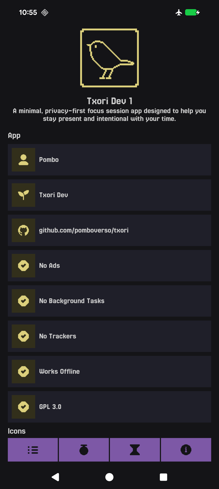

# Txori

**Txori** is...

Built entirely in **native Kotlin**, Txori runs fully **on-device**, avoids tracking, and ...

---

## Screenshots

| Tasks                                                                     | Stopwatch                                                                     | About                                                                     |
| ------------------------------------------------------------------------ | ---------------------------------------------------------------------------- | ------------------------------------------------------------------------- |
|  |  |  |

---

## Features

- **App grouping & quick actions**: Long press any app to assign it to a group, rename it, or access
  additional actions. Grouped apps help you stay organized and find what you need faster.
- **Battery monitoring**: Monitor battery status, temperature and performance.
- **Day of the year**: Track the current day of the year at a glance for productivity or personal
  tracking.

---

## Usage

- Long-press in an empty area of the **app list** to open **Settings**.
- Watch the **[Mako Demo / Walkthrough](https://www.youtube.com/watch?v=cfble2DRqyM)** for a quick
  overview.

---

## Installation

- Available on **[F-Droid](https://f-droid.org/app/com.rama.mako)** for easy installation and
  updates.
- Download the latest APK from the **[Releases page](https://github.com/pomboverso/mako/releases)
  ** or use **[Obtanium](https://github.com/ImranR98/Obtainium)** to get the newest version directly
  from the github releases.

## Signing certificate hash

**SHA-256 Fingerprint:**

```
8D:29:CC:EC:70:F0:C1:AD:6F:F5:FC:C2:3B:C2:49:D4:20:47:6D:B9:F3:A0:48:18:E9:11:26:BA:9A:D2:A9:78
```

---

## License

**Txori** is Free Software. You are free to use, study, share, and improve it under the terms of the
**GNU General Public License v3** or later.

---

## Tested Devices

| Device       | OS         | Year | Status      |
| ------------ | ---------- | ---- | ----------- |
| Pixel 8 Pro  | Android 16 | 2026 | ✅ Verified |
| Pixel 6      | GrapheneOS | 2026 | ✅ Verified |
| Samsung On 5 | Android 6  | 2015 | ✅ Verified |

---

## Documents

- [Branding](./docs/branding.md)
- [Attributions](./docs/attributions.md)